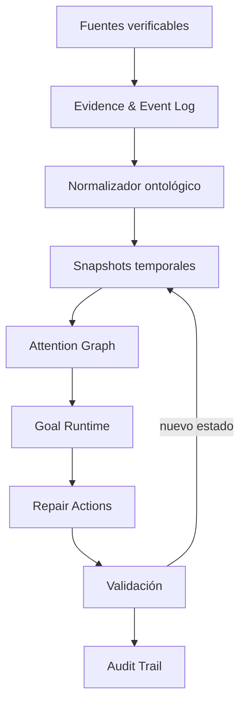

# Memoria Viva — Blueprint integral de arquitectura y construcción

**Estado:** especificación inicial de producto y construcción  
**Fecha:** 2026-07-18  
**Caso de demostración:** founder recibe una oportunidad externa de OpenAI y Memoria Viva reconstruye qué cambió, cómo afecta sus compromisos y qué merece atención ahora.

---

## 1. Resumen ejecutivo

Memoria Viva es una capa temporal de memoria, atención y ejecución para founders. Ingiere eventos verificables, conserva su procedencia, reconstruye snapshots de estado, conecta cada cambio con Goals, compromisos, restricciones, decisiones y bloqueos, y produce un ranking explicable de atención.

El producto no termina al recomendar una prioridad. Cada recomendación entra en un ciclo operativo:

`evento → evidencia → snapshot → Attention Graph → Goal → acción → validación → nuevo snapshot`

La demostración usa un caso real pero sanitizado: llega una invitación de OpenAI y el hackathon se modela como un experimento acotado al servicio de `GC-01 — PRODUCT_VALIDATION`, no como un cuarto Goal. Las reglas oficiales se convierten en constraints; Calendar aporta evidencia temporal sin pretender representar toda la verdad estratégica; el sistema identifica compromisos protegidos, condicionalmente desplazables o pendientes de confirmación y genera un ranking de atención con evidencia. Memoria Viva se usa para decidir, construir y auditar Memoria Viva.

La recomendación principal es construir primero un vertical slice completo y reproducible. Aprovechar muchas herramientas solo agrega valor si cada una resuelve una función verificable; el número de agentes o integraciones no es una métrica de calidad.

---

## 2. Tesis de producto

### Problema

Los founders acumulan correos, eventos, conversaciones, decisiones y compromisos, pero carecen de una representación viva de cómo un evento nuevo altera el sistema completo. Las herramientas actuales recuerdan elementos o administran tareas; rara vez explican el cambio de estado y sus consecuencias.

### Propuesta

Memoria Viva convierte señales dispersas en transiciones de estado auditables:

- qué ocurrió;
- qué cambió respecto al snapshot anterior;
- qué Goal afecta;
- qué compromisos soporta, bloquea o desplaza;
- qué merece atención;
- qué acción mínima se recomienda;
- cómo se comprobará si funcionó.

### Promesa demostrable

> Memoria Viva no solo recuerda una oportunidad. Comprueba cómo esa oportunidad modifica el sistema de compromisos, decide qué debe moverse y explica por qué.

### Diferenciador

El diferenciador no es tener Calendar, correo, agentes o resúmenes. Es combinar:

1. memoria temporal versionada;
2. procedencia y evidencia;
3. Attention Graph explicable;
4. Goals con condición verificable de finalización;
5. ciclos de reparación y validación;
6. una arquitectura de contexto eficiente y auditable.

---

## 3. Funcionalidades consolidadas de las fuentes

> **Estado de alcance:** las secciones 3.3–3.7 describen roadmap diferido. Repair loops, subagents, prompt caching, continuidad de reasoning y Programmatic Tool Calling no forman parte de los contratos de Phase 0 ni de la primera implementación de Phase 1.

### 3.1 Agente recurrente de extremo a extremo

El patrón extraído del cookbook de workspace agents es:

`trigger → filtrar → recuperar contexto → sintetizar → crear artefacto → notificar → persistir`

Aplicación a Memoria Viva:

- Calendar y correo funcionan como fuentes iniciales.
- Los filtros descartan eventos sin cambio material o sin relación con un Goal.
- La memoria recupera proyectos, decisiones, restricciones y compromisos relacionados.
- El sistema crea un decision brief y un nuevo snapshot.
- Las ejecuciones pueden ocurrir bajo demanda, por horario o ante un evento.
- Cada fuente opera con permisos mínimos y procedencia explícita.

### 3.2 Goal como contrato persistente

Un Goal no es una tarea ni un prompt grande. Es un contrato de finalización con:

- resultado deseado;
- superficie de verificación;
- restricciones;
- límites de herramientas, datos y alcance;
- política de iteración;
- condición de bloqueo;
- presupuesto;
- ciclo de vida.

Estados iniciales:

`draft → active → paused → completed | blocked | budget_limited | cleared`

El modelo puede proponer que un Goal está completo, pero el sistema solo debe confirmarlo cuando la evidencia satisface la superficie de verificación.

### 3.3 Ciclo iterativo de reparación

El patrón de repair loops introduce tres fases separadas:

1. **Review:** detectar hallazgos sin modificar el estado.
2. **Repair:** proponer o ejecutar el menor cambio útil.
3. **Validate:** comprobar el resultado y producir el delta restante.

El ciclo continúa con feedback estructurado:

`finding → repair_action → validation_result → remaining_delta`

Condiciones de parada:

- validación aprobada;
- máximo de intentos alcanzado;
- el delta deja de disminuir;
- falta evidencia o autoridad;
- la siguiente decisión requiere revisión humana.

### 3.4 Subagents y protección del contexto principal

Los subagents permiten ejecutar trabajos independientes en paralelo y devolver resúmenes al agente principal. La documentación oficial recomienda especialmente exploración, pruebas, triage y síntesis; los trabajos de escritura paralela requieren mayor cautela por conflictos y coordinación.

Aplicación:

- el agente principal conserva Goal, constraints, decisiones y output final;
- los subagents absorben búsquedas, logs, normalización, revisión y validación;
- cada subagent recibe un trabajo estrecho, un esquema de salida y un límite;
- la profundidad se mantiene en `1` para evitar fan-out recursivo;
- los permisos heredados se restringen, con workers de análisis en read-only;
- el sistema espera resultados y consolida diferencias en el thread principal.

### 3.5 Prompt caching

Prompt caching permite reutilizar prefijos idénticos. En GPT-5.6 se pueden definir breakpoints explícitos y una `prompt_cache_key`. Los cache hits requieren coincidencia exacta del prefijo, por lo que el contenido estable debe ir primero y la información dinámica al final.

Aplicación:

- cachear ontología, políticas, schemas, definiciones de roles y criterios de validación;
- no incluir snapshots cambiantes dentro del prefijo estable;
- versionar la clave cuando cambie la ontología o la política;
- medir lecturas y escrituras en vez de asumir ahorro;
- usar breakpoints solo para bloques que se reutilizan realmente.

### 3.6 Razonamiento persistente entre turnos

Cuando Goals, supuestos y prioridades permanecen estables, GPT-5.6 puede usar `reasoning.context: "all_turns"` junto con `previous_response_id`. Cuando el objetivo o los supuestos cambian materialmente, se debe usar `current_turn` para evitar anclaje en razonamiento obsoleto.

Esto es una optimización de continuidad, no la memoria canónica del producto. El estado autoritativo siempre debe permanecer en snapshots, objetos de dominio y evidencia persistida.

### 3.7 Programmatic Tool Calling

Programmatic Tool Calling permite que el modelo componga y ejecute JavaScript para coordinar herramientas en un V8 aislado. Es apropiado para etapas acotadas con flujo predecible: filtrar, unir, deduplicar, agregar, rankear o validar resultados.

Debe mantenerse tool calling directo cuando:

- una sola llamada es suficiente;
- cada resultado exige nuevo juicio del modelo;
- la acción requiere aprobación;
- deben preservarse citas o artefactos nativos;
- hay consecuencias externas importantes.

### 3.8 Auditoría de AGENTS.md y Skills

`AGENTS.md` debe contener reglas durables del repositorio: estructura, comandos, convenciones, constraints y Definition of Done. Los workflows especializados deben vivir en Skills, que se cargan bajo demanda mediante progressive disclosure.

No se debe copiar la misma ontología o política en `AGENTS.md`, cada Skill, cada agent TOML y cada prompt. Debe existir una fuente canónica y referencias explícitas.

---

## 4. Arquitectura funcional



### Capa 0 — Fuentes

MVP:

- Calendar;
- correo o evento OpenAI;
- estado de la repo;
- documentos de reglas del hackathon;
- preferencias explícitas del founder.

Cada lectura debe registrar `source_id`, propietario, timestamp, permisos, método de captura y hash o identificador estable cuando esté disponible.

### Capa 1 — Evidence & Event Log

Registro append-only de hechos observados. No debe mezclar hechos con inferencias.

Estados epistemológicos:

- `confirmed`: observado directamente en una fuente;
- `approximate`: reconstrucción con evidencia parcial;
- `inferred`: conclusión derivada;
- `blocked`: no verificable por falta de acceso o datos;
- `uncertain`: evidencia insuficiente o contradictoria.

### Capa 2 — Normalización

Convierte entradas heterogéneas a objetos estables. Debe ser determinista siempre que sea posible y devolver warnings cuando falten campos.

### Capa 3 — Snapshots

Un snapshot representa el estado conocido en un instante:

- Goals activos;
- compromisos;
- restricciones;
- decisiones;
- bloqueos;
- artefactos;
- relaciones;
- ranking de atención;
- evidencia disponible.

Nunca se sobrescribe el pasado. Un nuevo snapshot referencia al anterior y almacena el diff.

### Capa 4 — Attention Graph

Construye relaciones temporales y causales. Produce un ranking, pero también una explicación legible y trazable.

### Capa 5 — Goal Runtime

Mantiene el contrato del objetivo, evalúa progreso, selecciona el siguiente experimento y aplica condiciones de parada.

### Capa 6 — Repair Actions

Propone la intervención mínima efectiva. En el MVP, cambios de Calendar o comunicaciones externas se presentan para aprobación; no se ejecutan automáticamente.

### Capa 7 — Validación y auditoría

Comprueba si la acción produjo el estado esperado y conserva un recibo por iteración.

---

## 5. Ontología inicial

### Entidades

| Entidad | Propósito |
|---|---|
| `Source` | Sistema o documento de origen |
| `SourceEvent` | Hecho externo observado |
| `Actor` | Persona, equipo o agente responsable |
| `Project` | Contenedor estratégico |
| `Goal` | Resultado persistente y verificable |
| `Constraint` | Condición que no puede violarse |
| `Commitment` | Obligación asumida con tiempo o responsable |
| `Decision` | Elección registrada y su racional |
| `Blocker` | Condición que impide progreso |
| `Artifact` | Repo, propuesta, brief, demo o documento |
| `Evidence` | Soporte verificable de una afirmación |
| `Snapshot` | Estado versionado en un instante |
| `AttentionItem` | Unidad rankeable de atención |
| `Finding` | Desviación o conflicto detectado |
| `RepairAction` | Cambio propuesto o ejecutado |
| `ValidationCase` | Prueba de aceptación |
| `ValidationResult` | Evidencia producida por una prueba |
| `RemainingDelta` | Diferencia aún no cerrada |
| `RunRecord` | Recibo completo de una ejecución |
| `Preference` | Regla personal explícita del usuario |
| `Notification` | Resumen o alerta entregada |

### Relaciones

- `derived_from`
- `supports`
- `conflicts_with`
- `blocks`
- `depends_on`
- `supersedes`
- `displaces`
- `scheduled_for`
- `owned_by`
- `constrained_by`
- `verified_by`
- `produced_by`
- `changes_between`

`attempts_to_resolve` queda fuera del vocabulario activo de Phase 0 con estado `DEFERRED_FOR_REPAIR_LOOP_EXTENSION`. Solo puede regresar mediante una decisión ontológica versionada cuando se autorice el repair loop.

### Regla de procedencia

Toda arista inferida debe guardar:

- evidencia de origen;
- agente o regla que la creó;
- timestamp;
- nivel de confianza;
- explicación breve;
- versión de la ontología.

---

## 6. Attention Graph

### Objetivo

Rankear qué merece atención y explicar la composición del score. El ranking no debe esconder los trade-offs.

### Heurística inicial

Ponderaciones propuestas para el MVP:

| Componente | Peso |
|---|---:|
| Urgencia temporal | 0.25 |
| Impacto downstream | 0.20 |
| Alineamiento estratégico | 0.20 |
| Conflicto o desplazamiento | 0.15 |
| Novedad del evento | 0.10 |
| Confianza de evidencia | 0.10 |

`attention_score = Σ(componente_normalizado × peso)`

Estas ponderaciones forman la política v1 aprobada y permanecen fijas en este contrato. Cualquier cambio de peso o threshold requiere una nueva versión y aprobación humana; la política puede compararse en evals sin alterar silenciosamente la versión vigente.

### Output mínimo por ítem

La forma canónica está en `schemas/attention-item.schema.json`. Un ítem de
producción exige score numérico, los seis componentes y sus contribuciones,
identidad y digest de política, evidencia, costos desplazados, protecciones,
confirmaciones, confianza, incertidumbre y digest de cálculo. El oracle humano
usa `schemas/expected-attention-ranking.schema.json` y no contiene scores ni
contribuciones de producción.

### Guardrails

- No rankear un ítem sin evidencia mínima.
- Separar urgencia de importancia.
- Mostrar compromisos desplazados y costo de oportunidad.
- Permitir `needs_confirmation` cuando el sistema no puede decidir.
- No convertir preferencias inferidas en restricciones duras.

---

## 7. Controlled public Goal model and demo boundary

El modelo público controlado contiene exactamente tres Goals aprobados:

- `GC-01 — PRODUCT_VALIDATION`;
- `GC-02 — FINANCIAL_AND_OPERATIONAL_CONTINUITY`;
- `GC-03 — PERSONAL_AND_LEGAL_CONTINUITY`.

El hackathon es un experimento acotado que sirve a `GC-01`; no es un cuarto Goal. `G5` se conserva con visibilidad `OMITTED_FROM_CONTROLLED_DEMO`: no está eliminado, rechazado, invalidado, completado ni cleared. La visibilidad del demo y el lifecycle operativo son dimensiones independientes.

Un Goal solo pasa a `completed` cuando todas sus superficies requeridas están respaldadas por evidencia y un validador determinista las acepta. La mera existencia de un archivo o la afirmación de un modelo no acredita completion.

### Boundary temporal e identidad

- `T0` es el snapshot inmediatamente anterior al trigger canónico normalizado.
- `T1` es el snapshot inmediatamente posterior a aplicar únicamente ese trigger.
- Los follow-ups se relacionan con el trigger, pero quedan fuera de `T1`.
- `received_at`, `occurred_at` y `deadline_at` conservan significados distintos; un `occurred_at` desconocido permanece desconocido.
- La identidad de un candidato de Calendar y la identidad de un compromiso operacional son distintas y se conectan solo mediante lineage explícito, evidencia, confianza e incertidumbre; la similitud de títulos no crea identidad.

### Orden y ranking aprobados

La transición controlada conserva `BUILD_FIRST`: la construcción mínima precede a la validación dependiente. La expectativa ordinal humana es un oracle separado, sin scores numéricos de producción. El ranking computado conserva score numérico, seis componentes, identidad y digest de política y cálculo determinista.

La construcción de los payloads aprobados pertenece a Phase 0C2. La aplicación, el runtime y la ejecución determinista pertenecen a Phase 1.

---

## 8. Orquestación con subagents

> **Roadmap diferido:** las secciones 8–11 no describen contratos ni implementación autorizados para Phase 0D2 o la primera Phase 1. Subagents, PTC, caching, reasoning continuity y el repair-loop runtime requieren autorización y decisiones versionadas posteriores al vertical slice determinista.

### Topología recomendada

Mantener un agente principal y hasta cuatro workers directos. Profundidad máxima `1`.

| Agente | Trabajo | Modo recomendado | Escritura |
|---|---|---|---|
| `orchestrator` | Goal, decisiones, integración y respuesta final | GPT-5.6, razonamiento alto | Controlada |
| `evidence_explorer` | Inspeccionar fuentes y extraer evidencia | GPT-5.6 Terra, medio | No |
| `ontology_normalizer` | Convertir evidencia a objetos y relaciones | GPT-5.6 Terra o GPT-5.6, medio | Solo output estructurado |
| `attention_reviewer` | Auditar ranking, contradicciones y costos desplazados | GPT-5.6, alto | No |
| `validator` | Ejecutar evals, verificar artefactos y producir delta | GPT-5.6, medio/alto | Registros de validación |

### Configuración inicial

```toml
[agents]
max_threads = 4
max_depth = 1
job_max_runtime_seconds = 900
interrupt_message = true
```

Los nombres concretos de modelos deben ajustarse a la disponibilidad del entorno. La separación de roles importa más que el pin exacto.

### Reglas de delegación

Delegar cuando:

- existen dos o más investigaciones independientes;
- la tarea es read-heavy;
- los resultados pueden devolverse con schema;
- la paralelización reduce latencia sin crear conflictos.

No delegar cuando:

- existe una única acción corta;
- varios agentes editarían el mismo archivo;
- la decisión requiere contexto integrado del Goal;
- el costo de coordinación supera el trabajo.

### Contrato del subagent

Cada delegación debe declarar:

- objetivo estrecho;
- fuentes permitidas;
- herramientas disponibles;
- prohibiciones;
- schema de salida;
- deadline o presupuesto;
- si el agente principal debe esperar todos los resultados.

---

## 9. Programmatic Tool Calling

### Usos en Memoria Viva

Usar PTC para etapas determinables:

- leer varias ventanas de Calendar en paralelo;
- deduplicar eventos y mensajes;
- unir eventos con proyectos y compromisos;
- aplicar reglas de normalización;
- calcular diffs entre snapshots;
- computar el score ponderado;
- agregar resultados de validación;
- reducir outputs grandes a JSON compacto.

### Mantener llamadas directas para

- solicitar aprobación;
- modificar Calendar o enviar mensajes;
- consultar una fuente cuando el resultado cambia el plan;
- conservar citas completas;
- producir o transferir artefactos nativos;
- resolver ambigüedad semántica importante.

### Contrato de cada programa

- tools permitidas;
- inputs y schema de output;
- concurrencia máxima;
- timeout;
- reintentos;
- comportamiento ante error parcial;
- máximo de resultados;
- criterio de parada.

El runtime V8 es aislado: no debe asumirse Node.js, filesystem general, red directa, paquetes, subprocesses ni estado persistente. Todo acceso externo ocurre mediante tools habilitadas.

---

## 10. Estrategia de contexto y costos

### 10.1 Capas del prompt

Orden recomendado:

1. rol y propósito estable;
2. reglas de seguridad y permisos;
3. ontología versionada;
4. schemas de output;
5. Definition of Done;
6. snapshot y Goal actuales;
7. evento nuevo;
8. instrucción concreta del turno.

Las capas 1–5 son candidatas a caching. Las capas 6–8 son dinámicas.

### 10.2 Claves de cache

Convención:

`mv:{tenant}:{agent_role}:{ontology_version}:{policy_version}`

Ejemplo:

`mv:founder_demo:attention_reviewer:v1:v1`

Cambiar la versión cuando se modifica contenido estable. No reutilizar una clave entre tenants o políticas materialmente distintas.

### 10.3 Breakpoints

Ubicar breakpoints después de:

- instrucciones estables;
- ontología + schemas;
- rubric de validación.

No ubicar breakpoints dentro de:

- snapshot actual;
- eventos del usuario;
- ranking previo mutable;
- outputs de tools.

### 10.4 Métricas de caching

- `cached_tokens`;
- `cache_write_tokens`;
- costo de escritura vs ahorro posterior;
- cache-hit rate por key;
- latencia warm vs cold;
- frecuencia de invalidación por versión.

En GPT-5.6, una escritura de cache tiene costo superior al input no cacheado, por lo que un bloque que no se reutilice puede aumentar el costo. La optimización debe medirse después de un baseline funcional.

---

## 11. Continuidad de razonamiento

### Política

Usar `all_turns` cuando:

- Goal y constraints siguen iguales;
- la siguiente acción pertenece al mismo repair loop;
- los supuestos anteriores siguen vigentes;
- existe un `previous_response_id` o historial compatible.

Usar `current_turn` cuando:

- el usuario reemplaza el Goal;
- cambia la ontología o la fuente de verdad;
- nueva evidencia contradice supuestos centrales;
- el loop está estancado y necesita replanteamiento;
- el contexto anterior podría anclar al modelo.

### Estado a persistir por run

- `response_id`;
- modo efectivo de `reasoning.context`;
- `goal_id` y versión;
- `snapshot_id`;
- versión de ontología;
- herramientas utilizadas;
- costo y tokens;
- resultado de validación.

### Regla crítica

La continuidad de razonamiento nunca sustituye el estado explícito. Si se pierde `previous_response_id`, Memoria Viva debe poder reconstruir el trabajo desde Goal, snapshot, evidencia y run records.

---

## 12. Sistema de instrucciones

### Qué vive en cada superficie

| Superficie | Contenido |
|---|---|
| `AGENTS.md` | Mapa de repo, comandos, constraints, DoD y reglas compartidas |
| `.codex/config.toml` | Modelos, sandbox, permisos, subagents y herramientas |
| `.codex/agents/*.toml` | Rol estrecho de cada custom agent |
| `.agents/skills/*/SKILL.md` | Workflow reusable y task-specific |
| `docs/ontology.md` | Definición canónica de entidades y relaciones |
| `schemas/*.json` | Contratos machine-readable |
| Prompt del turno | Objetivo y contexto que solo aplican ahora |
| Código | Reglas deterministas, invariantes y validaciones |

### AGENTS.md mínimo

Debe contener únicamente:

- propósito del proyecto;
- estructura importante;
- comandos para ejecutar y validar;
- fuente canónica de ontología y schemas;
- constraints de privacidad;
- regla de separar hechos e inferencias;
- Definition of Done;
- cuándo delegar a subagents;
- archivos que no deben editarse simultáneamente.

### Skills iniciales

1. `capture-founder-snapshot`
2. `normalize-memory-events`
3. `build-attention-graph`
4. `run-goal-contract`
5. `validate-repair-loop`
6. `sanitize-demo-fixture`

Cada Skill debe tener una descripción corta con trigger y límites. Las instrucciones extensas o ejemplos deben vivir en references/scripts para aprovechar progressive disclosure.

### Auditoría de instrucciones

Antes de cada milestone:

- detectar párrafos duplicados entre `AGENTS.md`, Skills y agents;
- mover reglas deterministas al código;
- mover schemas a archivos canónicos;
- eliminar instrucciones vagas o contradictorias;
- conservar solo guidance nacida de errores observados;
- revisar tamaño del prefijo estable y cache invalidation;
- ejecutar una prueba donde un agente nuevo complete el workflow sin contexto manual.

---

## 13. Estructura recomendada de repo

```text
/
├── AGENTS.md
├── README.md
├── .codex/
│   ├── config.toml
│   └── agents/
│       ├── evidence-explorer.toml
│       ├── attention-reviewer.toml
│       └── validator.toml
├── .agents/
│   └── skills/
│       ├── capture-founder-snapshot/SKILL.md
│       ├── normalize-memory-events/SKILL.md
│       ├── build-attention-graph/SKILL.md
│       ├── run-goal-contract/SKILL.md
│       ├── validate-repair-loop/SKILL.md
│       └── sanitize-demo-fixture/SKILL.md
├── docs/
│   ├── architecture.md
│   ├── ontology.md
│   ├── attention-scoring.md
│   ├── privacy.md
│   └── demo-script.md
├── schemas/
│   ├── event.schema.json
│   ├── snapshot.schema.json
│   ├── goal.schema.json
│   ├── attention-item.schema.json
│   └── run-record.schema.json
├── fixtures/
│   └── founder-hackathon/
│       ├── calendar-t0.json
│       ├── openai-event.json
│       ├── expected-snapshot-t1.json
│       ├── expected-attention-ranking.json
│       └── privacy-manifest.json
├── src/
│   ├── ingestion/
│   ├── ontology/
│   ├── graph/
│   ├── goals/
│   ├── orchestration/
│   ├── repair/
│   └── audit/
├── evals/
│   ├── provenance/
│   ├── ranking/
│   ├── replay/
│   ├── privacy/
│   └── convergence/
└── runs/
    └── .gitkeep
```

Los outputs locales sensibles de `runs/` no deben versionarse. La demo usa fixtures sanitizados versionables.

---

## 14. RunRecord y audit trail

La forma canónica está en `schemas/run-record.schema.json`. El recibo conserva
identidad y versión de inputs y outputs, snapshots anterior y nuevo, trigger,
GraphDelta, rankings before/after, Goals, fuentes, aprobaciones, preguntas no
resueltas, versiones de schema/ontología/política, digests de replay, warnings,
privacidad y metadata de modelo nullable en Replay Mode. Claims de compliance,
submission, Goal completion o displacement ejecutado permanecen separados y
requieren evidencia y validación.

Un run debe contestar:

1. ¿Qué observó el sistema?
2. ¿Qué cambió?
3. ¿Qué recomendó o ejecutó?
4. ¿Qué evidencia lo respalda?
5. ¿Funcionó?
6. ¿Qué falta?

---

## 15. Demo reproducible

### Escena 1 — Antes

Mostrar el Calendar y snapshot de los últimos días con Goals y compromisos actuales. El ranking inicial debe existir antes de introducir el evento.

### Escena 2 — Evento externo

Inyectar el correo sanitizado de OpenAI con fuente, timestamp, deadline y reglas asociadas.

### Escena 3 — Reconstrucción

El sistema normaliza el evento, recupera contexto relacionado y añade relaciones al grafo.

### Escena 4 — Cambio de atención

Mostrar lado a lado:

- ranking anterior;
- ranking nuevo;
- compromisos desplazados;
- explicación por componente;
- evidencia;
- incertidumbre.

### Escena 5 — Goal Runtime

Mostrar el hackathon como experimento acotado al servicio de `GC-01`, junto con superficie de verificación, constraints, progreso y delta pendiente; no activar un Goal adicional.

### Escena futura — Repair loop (`DEFERRED_ROADMAP`)

Después del vertical slice autorizado, proponer el menor ajuste al plan, validarlo contra un snapshot posterior o fixture esperado y registrar si converge o necesita input humano. Esta escena no forma parte de Phase 0C2 ni de la primera Phase 1.

### Escena 7 — Autorreferencia

Cerrar con el audit trail de cómo Memoria Viva se usó para construir y auditar su propia submission.

---

## 16. Validación y evals

> Los evals de repair loop y subagents enumerados aquí son roadmap diferido; no son tests ni contratos activos de Phase 0D2 o de la primera Phase 1.

### Evals funcionales

- El evento OpenAI se normaliza correctamente.
- El snapshot t1 contiene referencia a t0.
- El ranking cambia después del evento.
- El top item incluye evidencia y compromisos desplazados.
- El Goal no se completa con validaciones pendientes.
- El repair loop se detiene al aprobar, bloquearse o agotar intentos.

### Evals epistemológicas

- Toda afirmación factual tiene `evidence_ref`.
- Inferencias están etiquetadas como inferencias.
- No se convierten aproximaciones en hechos.
- La falta de acceso produce `blocked`, no contenido inventado.

### Evals de privacidad

- Cero PII no autorizada en fixtures.
- Separación física entre datos reales y demo.
- Permisos read-only por defecto.
- Acciones externas requieren aprobación explícita.

### Evals de arquitectura

- Replay determinista de normalización y scoring.
- Schemas validan todos los handoffs.
- Subagents retornan output estructurado.
- Ningún subagent excede profundidad `1`.
- Las escrituras paralelas no tocan el mismo artefacto.

### Métricas iniciales

| Métrica | Objetivo MVP |
|---|---:|
| Afirmaciones factuales con evidencia | 100% |
| PII no autorizada en fixture | 0 |
| Top 3 con explicación de score | 100% |
| Replay del caso de demo | 100% pass |
| Repair iterations | ≤ 3 |
| Goals completados sin superficie verificada | 0 |
| Profundidad de subagents | 1 |

Métricas de optimización posteriores:

- costo por Goal completado;
- latencia cold/warm;
- cache read/write ratio;
- crecimiento del contexto principal;
- PTC compression ratio;
- porcentaje de runs que requieren intervención humana;
- reducción del remaining delta por iteración.

---

## 17. Plan de construcción

### Fase 0D2 — Reconciliación de contratos

- Alinear blueprint, ontología y schemas con las decisiones humanas aprobadas.
- Mantener separados contratos genéricos y aserciones específicas del fixture.
- Definir por separado ranking computado y oracle ordinal humano.

### Fase 0C2 — Construcción del fixture aprobado

- Crear el fixture sanitizado T0 → T1 desde el handoff aprobado.
- Convertir las expectativas humanas en un oracle ordinal sin scores numéricos.
- Conservar candidatos activos y excluidos-pero-retenidos con lineage explícito.
- Convertir reglas oficiales en constraints solo donde exista evidencia autorizada.

### Fase 1 — Vertical slice

- Ingerir `calendar-t0.json` y `openai-event.json`.
- Crear snapshot t0 y t1.
- Construir relaciones mínimas.
- Mostrar ranking before/after con evidencia.

### Fase 2 — Goal Runtime

- Implementar lifecycle.
- Superficies de verificación.
- Constraints y blocked stop condition.
- Persistir progreso por run.

### Fase 3 — Repair loop

- Review estructurado.
- Repair action mínima.
- Validación.
- Remaining delta.
- Máximo de tres iteraciones.

### Fase 4 — Subagents

- Extraer exploración y validación a workers read-only.
- Mantener integración en el agente principal.
- Medir reducción de ruido en el contexto principal.

### Fase 5 — Optimización API

- Baseline de costo y latencia.
- Ordenar prefijos estables.
- Agregar cache keys y breakpoints.
- Activar continuidad de reasoning donde corresponda.
- Mover etapas determinables a PTC.

### Fase 6 — Demo y submission

- Script de 2–3 minutos.
- README orientado a jueces.
- Replay automatizado.
- Captura de audit trail.
- Privacy manifest.
- Verificación final contra reglas oficiales.

---

## 18. Definition of Done del MVP

> Esta Definition of Done describe el MVP ampliado. Los puntos de repair loop, subagents, caching, reasoning y PTC permanecen diferidos hasta después del vertical slice determinista.

El MVP está listo cuando:

- existe un fixture real sanitizado y reproducible;
- se puede reconstruir el snapshot antes y después del evento;
- el Attention Graph cambia el ranking de manera explicable;
- cada afirmación importante cita evidencia;
- el sistema identifica compromisos desplazados;
- el Goal tiene constraints y superficie de verificación;
- el repair loop produce un `remaining_delta` y una condición de parada;
- el run genera un audit trail completo;
- la demo funciona desde un entorno limpio siguiendo el README;
- las reglas del hackathon están mapeadas a pruebas;
- no se expone información personal innecesaria;
- las optimizaciones de caching, reasoning y PTC están medidas o claramente marcadas como posteriores.

---

## 19. Riesgos y decisiones

### Riesgo: demo demasiado biográfica

Mitigación: fixture sanitizado, pocos eventos, nombres genéricos y narrativa comprensible para cualquier founder.

### Riesgo: parecer un task manager

Mitigación: enfatizar diffs temporales, relaciones causales, desplazamiento de compromisos, Goal Runtime y evidencia.

### Riesgo: ranking opaco

Mitigación: score descompuesto, pesos versionados, evidencia y uncertainty por ítem.

### Riesgo: sobreingeniería multi-agent

Mitigación: profundidad `1`, máximo cuatro workers, tareas read-heavy y schemas estrechos.

### Riesgo: caching contraproducente

Mitigación: baseline, keys versionadas, breakpoints estables y medición de writes vs reads.

### Riesgo: reasoning obsoleto

Mitigación: `current_turn` cuando cambien Goals o supuestos; estado canónico fuera del reasoning.

### Riesgo: automatizar acciones sensibles

Mitigación: read-only por defecto y aprobación explícita para cambios externos.

### Riesgo: instrucciones duplicadas

Mitigación: una fuente canónica por concepto, Skills pequeñas y auditoría periódica.

---

## 20. Parámetros recomendados para iniciar

> Los parámetros de subagents, repair, caching, reasoning y PTC son referencias de roadmap y no autorizan su implementación en Phase 0D2, Phase 0C2 ni en la primera Phase 1.

| Parámetro | Valor inicial |
|---|---|
| Evidencia temporal | Calendar + event log; no constituyen por sí solos la verdad estratégica completa |
| Datos de demo | Fixture real sanitizado |
| Main model | GPT-5.6 |
| Explorer model | GPT-5.6 Terra cuando esté disponible |
| Subagent depth | 1 |
| Max concurrent threads | 4 |
| Repair iterations | 3 |
| Calendar permissions | Read-only |
| External writes | Human approval |
| Reasoning context | `all_turns` solo con Goal estable |
| Prompt cache | Después de baseline; keys versionadas |
| PTC | Normalización, join, diff, scoring, agregación |
| Estado persistido canónico | Snapshots + graph + run records |
| Ranking | Determinista y explicable |
| Completion authority | Evidence-based validation |

---

## 21. Fuentes

Documentos proporcionados para este diseño:

- `chatgpt-agents-sales-meeting-prep (1).md`
- `using_goals_in_codex.ipynb`
- `Build_iterative_repair_loops_with_Codex.ipynb`

Documentación oficial consultada:

- [Subagents](https://learn.chatgpt.com/docs/agent-configuration/subagents?surface=app)
- [Prompt caching](https://developers.openai.com/api/docs/guides/prompt-caching)
- [Reasoning models](https://developers.openai.com/api/docs/guides/reasoning)
- [Conversation state](https://developers.openai.com/api/docs/guides/conversation-state)
- [Programmatic Tool Calling](https://developers.openai.com/api/docs/guides/tools-programmatic-tool-calling)
- [Model guidance](https://developers.openai.com/api/docs/guides/latest-model)
- [Build skills](https://learn.chatgpt.com/docs/build-skills)
- [AGENTS.md](https://learn.chatgpt.com/docs/agent-configuration/agents-md)

---

## 22. Próxima acción

Tras revisar, committear y mergear esta reconciliación, construir únicamente el fixture aprobado de Phase 0C2. Solo después de su autorización se inicia el vertical slice de Phase 1. Su primera prueba debe aceptar dos entradas —snapshot de Calendar y evento OpenAI— y producir cuatro outputs:

1. snapshot actualizado;
2. diff explicable;
3. ranking before/after;
4. `RunRecord` con evidencia.

Cuando esa transición sea reproducible, añadir Goal Runtime, repair loop, subagents y optimizaciones de contexto en ese orden.
